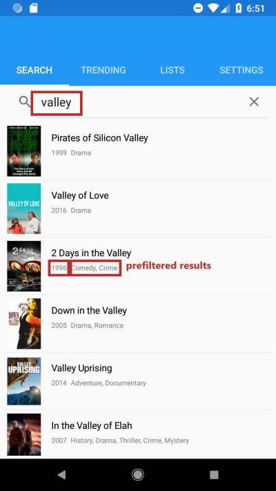

# Abstract 

The aim of this project is to produce a movie searcher/tracker/detailer mobile application based on [TMDb](https://www.themoviedb.org/)'s open [WebAPI](https://developers.themoviedb.org/3/getting-started/introduction) implementing the most important features the API exposes.

Platform code is kept to a minimum to provide a base for future code sharing with a possible iOS client: currently 98% of the app's code resides in the shared project. 

# Technology

* Xamarin.Forms as UI framework with MVVM pattern
* Using my own HTTP based REST client implementation 
* XUnit for integration testing with API server and YouTube scraper
* Newtonsoft.Json
* FFImageLoading for image caching
* LazyCache for object caching
* YoutubeExplode for YouTube video scraping (only when not targeting Google Play)
* CardsView for swipe based gallery with cards animation
* Dotfuscator for assembly obfuscation (currently not thoroughly tested, **don't build with it, has known problems**)
* Extensive care has been taken to provide a smooth, non blocking UI experience based on the Task-async pattern

# Features

The app -as of version nr. 55-  currently provides the following features 

### Searching, listing and getting recommendations:

* Search for movies based on keywords
* Configure search filters based on movies age, genre preferences, adult switch
* Top trending movies for the current week and day 
* Get the list of similar movies for the currently selected movie by tapping on the compass icon
* Get the list of recommended movies for the currently selected movie
* All result lists implement infinite scrolling  

### Get the movie's detailed info:  

* Tap a movie entry in a list to display its details (descriptions, length, score, countries, etc..)
* Tap on the people icon on the movie's detail page to have the movie's cast displayed in order 
* Tap on one person in the cast to open that person's detail page with swipeable gallery, biography and popularity index, list his movie participations separately as actor and crew member 
* Tap on the web-link icon to open the movie's page on your favorite movie website 
* Tap on the text icon to have any reviews displayed on a separate page. Here you also can rate the movie (need to be logged in)

### Gallery pictures and associated videos (trailers, behind the scenes etc):

* Swipe the gallery to view the movie's backdrop pictures, tap to view the picture in large
* Tap under the gallery to view trailer and other associated video clip thumbnails
* Tap a video thumbnail to watch the short video clip. Depending on the distribution platform the video is either played via the device default YouTube player (GooglePlay distribution) or (in case of an ad-hoc distribution) stream-scraped from Youtube and played with the apps built in player this circumvents any ads from YouTube. 
* In case of YouTube-scraping the target video quality of the scraped YouTube stream can be controlled from the Settings

### Favorite-, Watchlist and custom lists management: 
(**needs an account on TMDb** and the user needs to sign in on the app)

* View your personal Watchlist (bucket list) and Favorite lists
* Display and edit your user defined lists, set one of them as active
* Watchlist, Favorite list and user defined lists are server side features synchronized to the device
* Add any movie to your personal Watchlist or Favorite list by tapping on the bookmark or heart icon on the movie's page
* Add any movie to your currently selected custom list by taping on the '+' sign 
* Visual real time feedback of the movie's status in relation to your Watchlist, Favorite list, currently active custom list and your signed-in-status when opening the movie's detail page (green, red, gray colors) 

### Login and Settings:

* When starting up the application, you can opt out from logging in with your TMDb account
* Display your login status on the Settings page
* Configure safe search (porn) 
* Set your preferred language which governs the content's display language (descriptions, genre tags, posters etc...)
* Filter out old movies
* Configure your favorite movie genre categories, not matching items will be filtered out where appropriate
* Configure to which supported movie site the "more detail weblink" will direct you when opening external detailed movie, actor or crew info links. 
* Set your preferred YouTube stream quality (only applies to non GooglePlay distributions) for stream-scraping
* Configure HTTP/HTTPS option for fetching images (HTTPS is strongly recommended)


# Screenshots


 


<figure>
  
  <figcaption>This is my caption text.</figcaption>
</figure>




## Wiki features:

This wiki uses the [Markdown](http://daringfireball.net/projects/markdown/) syntax. The [MarkDownDemo tutorial](https://bitbucket.org/tutorials/markdowndemo) shows how various elements are rendered. The [Bitbucket documentation](https://confluence.atlassian.com/x/FA4zDQ) has more information about using a wiki.

The wiki itself is actually a git repository, which means you can clone it, edit it locally/offline, add images or any other file type, and push it back to us. It will be live immediately.

Go ahead and try:

```
$ git clone https://j4ni@bitbucket.org/j4ni/tmdb-client.git/wiki
```

Wiki pages are normal files, with the .md extension. You can edit them locally, as well as creating new ones.

## Syntax highlighting


You can also highlight snippets of text (we use the excellent [Pygments][] library).

[Pygments]: http://pygments.org/


Here's an example of some Python code:

```
#!python

def wiki_rocks(text):
    formatter = lambda t: "funky"+t
    return formatter(text)
```


You can check out the source of this page to see how that's done, and make sure to bookmark [the vast library of Pygment lexers][lexers], we accept the 'short name' or the 'mimetype' of anything in there.
[lexers]: http://pygments.org/docs/lexers/


Have fun!